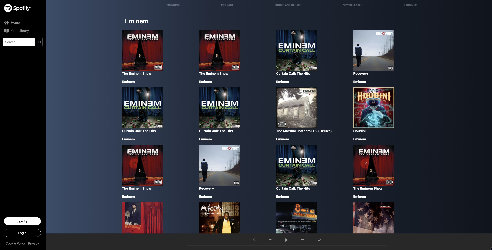

# Spotify Music App Clone

<p align="center">
  <a href="https://github.com/EmanWeBdV/EPICODE_M4-W3D1">
    
  </a>
</p>

<p align="center">
  A responsive <strong>Spotify-style music app</strong> built with HTML, CSS and JavaScript.<br/>
  Focus on API calls, dynamic rendering, search interaction and music-themed UI composition.<br/>
  <strong>This project was created during Module M4 of the Epicode course.</strong>
</p>

<p align="center">
  <a href="https://github.com/EmanWeBdV/EPICODE_M4-W3D1">
    
  </a>
  <a href="https://github.com/EmanWeBdV/EPICODE_M4-W3D1/issues">
    
  </a>
  <a href="#">
    
  </a>
</p>

<p align="center">
  <a href="#-preview">Preview</a>
  ·
  <a href="#-demo">Demo</a>
  ·
  <a href="https://github.com/EmanWeBdV/EPICODE_M4-W3D1/issues">Report a bug</a>
  ·
  <a href="https://github.com/EmanWeBdV/EPICODE_M4-W3D1/issues">Request a feature</a>
</p>

---

## ✨ Preview

<p align="center">
  
</p>

---

## 🔗 Demo

- **Live demo:** https://emanwebdv.github.io/EPICODE_M4-W3D1/


---

## 🧭 Table of Contents

- [Preview](#-preview)
- [Demo](#-demo)
- [Features](#-features)
- [Tech Stack](#-tech-stack)
- [Project Structure](#-project-structure)
- [Installation](#-installation)
- [Usage](#-usage)
- [API Integration](#-api-integration)
- [Project Pages](#-project-pages)
- [Responsiveness](#-responsiveness)
- [Roadmap](#-roadmap)
- [Author](#-author)
- [License](#-license)
- [Disclaimer](#-disclaimer)

---

## 🚀 Features

- **Spotify-inspired layout**
  - Fixed sidebar navigation
  - Music app visual structure
  - Bottom player section
  - Main page with music categories and artist sections

- **Artist content rendering**
  - Default artist loading for **Eminem**
  - Dynamic card generation through JavaScript
  - Album image, album title and artist name shown inside the page

- **Search functionality**
  - Search input for artist names
  - Search button to trigger API requests
  - Page content updated dynamically with fetched results

- **Details page navigation**
  - Album cards link to a dedicated `details.html` page
  - Artist data is passed through query parameters
  - Prepared structure for a more detailed artist view

- **Interactive UI**
  - Hover effects on links and images
  - Styled buttons for sign up and login
  - Responsive sidebar behavior on smaller screens

- **Educational Context**
  - Built as a frontend exercise to practice asynchronous JavaScript, API integration and dynamic DOM manipulation

---

## 🧱 Tech Stack

<p align="left">
  
  
  
  
</p>

---

## 📂 Project Structure

```bash
.
├── index.html
├── details.html
├── assets
│   ├── css
│   │   └── style.css
│   ├── js
│   │   └── script.js
│   └── img
│       ├── logo/
│       ├── playerbuttons/
│       └── ...other assets
└── README.md
